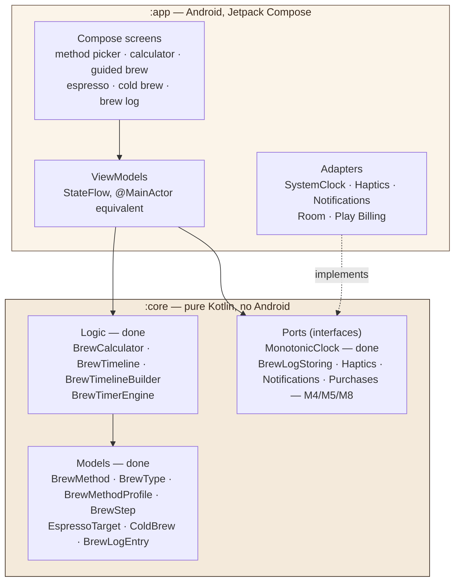
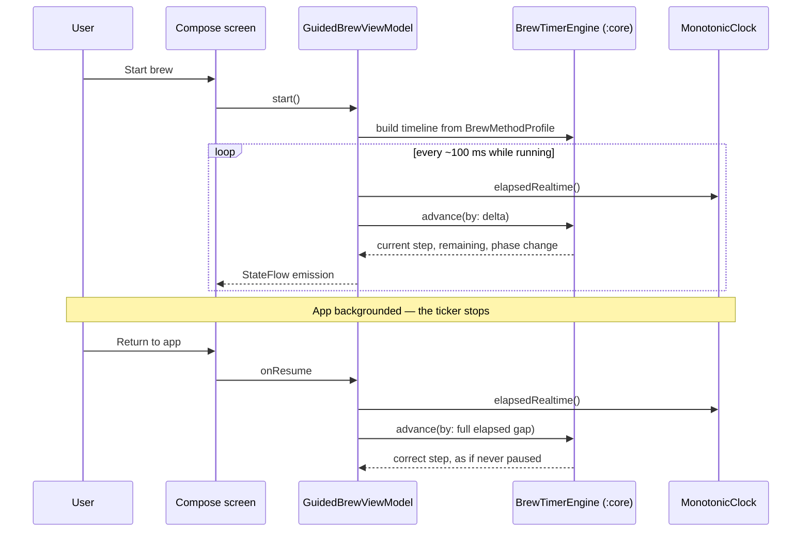

# CoffeeGrams for Android — Architecture

Two layers: a **pure Kotlin logic module** under a **thin Compose app**. Every
side effect crosses a port. This mirrors the iOS app deliberately — the shared
shape is what makes the two codebases maintainable in parallel.

> **Status (2026-08-07):** M2 and M3 complete. `:core` is fully ported: all 12
> Models/Logic files and the `MonotonicClock` port, plus all 49 conformance
> tests (`./gradlew :core:test`, headless, warnings-as-errors). The Compose
> theme (`ui/theme/`) carries the real palette and type scale, `BrewMethod`'s
> placeholder icon mapping is ported (`design/`), and the adaptive icon +
> standalone logo mark are the real brand mark, transliterated from the iOS
> repo's `render.swift`. The boxes marked *(M4)*…*(M9)* below are still the
> intended structure, not yet written. This document is updated as each
> milestone lands.

---

## Layers



**The one rule that matters:** the arrow from `:app` to `:core` is one-way.
`:core` does not know `:app` exists, does not import `android.*` or `androidx.*`,
and runs headless under `./gradlew :core:test`. CI enforces this with a grep over
`core/src/` — an Android import fails the build.

`:core` applies the `kotlin-jvm` plugin rather than `kotlin-android` precisely so
that the Android SDK is not even on its compile classpath.

---

## Ports and adapters

Every side effect is an interface in `:core` with a live adapter in `:app` and a
test double. This is what lets the entire brewing engine be tested with no
emulator, and what made the iOS→Android port cheap in the first place.

| Port *(in `:core`)* | Live adapter *(in `:app`)* | Test double | Milestone |
|---|---|---|---|
| `MonotonicClock` — **ported (M2)** | `SystemClock.elapsedRealtime()` | Fake advancing clock | M5 |
| `BrewLogStoring` | Room DAO | In-memory list | M4 |
| `Haptics` | `VibratorManager` / `HapticFeedbackConstants` | Recording spy | M5 |
| `Notifications` | Channel + WorkManager | Recording spy | M5 |
| `Purchases` | Play `BillingClient` | Scripted entitlement stub | M8 |

`DiagnosticsService` from iOS is **deliberately dropped** — it only wrote to
`os.Logger` and has no Android counterpart worth building.

**No DI framework.** Dependencies are constructed by hand in
`CoffeeGramsApplication` and passed down constructors. Five ViewModels does not
justify Hilt, and every dependency avoided is one that cannot affect the
"Data Not Collected" declaration.

---

## Guided brew — the flow that carries the risk



`BrewTimerEngine` **never reads a clock itself.** It is a pure delta-driven state
machine whose only input is `advance(by:)`. That is what makes the resume path
above correct rather than approximate: fast-forwarding by a 3-minute gap is the
same operation as ticking, just larger.

This is the single highest-risk area of the port (M9). Android freezes tickers
aggressively and Doze will stall a backgrounded app entirely, so the design is
**both** a foreground service with an ongoing notification **and** the
recompute-on-resume above — not one or the other.

---

## Testing topology

```mermaid
graph LR
    CT["`:core` unit tests<br/>JUnit 5 + kotlin.test<br/>the 49 ported cases"] -->|headless, no device| G1["./gradlew :core:test"]
    AT["`:app` unit tests<br/>ViewModels, Turbine on StateFlow"] -->|JVM| G2["./gradlew :app:testDebugUnitTest"]
    UI["Compose UI tests<br/>screens, TalkBack labels"] -->|emulator or device| G3["./gradlew :app:connectedAndroidTest"]
    MAN["Manual device pass<br/>billing · Doze · screen-off"] -->|physical device only| G4["M8 / M9 checklists"]

    style CT fill:#F4EADB,stroke:#3A2A1E,color:#3A2A1E
```

The 49 cases in `:core` are the **conformance spec**: they were written against
the shipping iOS app, so if they pass, identical inputs produce identical ratios,
timelines, and step transitions on both platforms. Any divergence is a port bug.

See [`testing.md`](testing.md) for how to run each suite.

---

## Module and package layout

| Path | Contents |
|---|---|
| `core/src/main/kotlin/com/jrlabapps/coffeegrams/core/` | Models, calculator, timeline builder, timer engine, ports |
| `core/src/test/kotlin/.../core/` | The ported conformance suite |
| `app/src/main/kotlin/com/jrlabapps/coffeegrams/` | `MainActivity`, `CoffeeGramsApplication` |
| `app/src/main/kotlin/.../ui/theme/` | Compose theme — palette, type scale |
| `app/src/main/kotlin/.../design/` | App-layer presentation mappings (`BrewMethod`'s placeholder icon), mirrors iOS's `Design/` folder |
| `app/src/main/res/drawable/ic_launcher_foreground.xml`, `logo_mark.xml` | The real brand mark (adaptive icon + standalone), transliterated from `coffeegrams_logo/render.swift` |
| `app/src/main/kotlin/.../ui/` | Screens and composables *(M7)* |
| `app/src/main/kotlin/.../data/` | Room entity, DAO, `BrewLogStoring` adapter *(M4)* |
| `app/src/main/kotlin/.../platform/` | Clock, haptics, notification adapters *(M5)* |
| `app/src/main/kotlin/.../billing/` | `BillingClient` adapter, `PurchaseController` *(M8)* |
| `gradle/libs.versions.toml` | Every dependency version, in one place |

---

## Build configuration

| Setting | Value | Why |
|---|---|---|
| `compileSdk` | **37.1** | Forced by AndroidX — core-ktx 1.19, activity-compose 1.13, lifecycle 2.11 and the Compose BOM all refuse a project compiling against 36 |
| `targetSdk` | **36** | The behaviour changes we opt into. Play's floor for new apps after 2026-08-31. Staying here means Android 17 runtime changes are not silently adopted |
| `minSdk` | **26** | Android 8.0. Covers effectively the whole active base; also means the adaptive icon is the only icon variant needed |
| AGP | **9.3.1** | Applies Kotlin itself — the `kotlin-android` plugin is gone and is rejected if applied |
| Kotlin | **2.4.10** | |
| Gradle | **9.7.0** | Configuration cache on |
| Warnings-as-errors | `:core` always; `:app` on release | The logic module is the correctness proof, so it is held to the stricter bar at all times |

**Third-party runtime dependencies: zero.** Everything shipped is Google or
JetBrains first-party. Turbine is the one exception and is test-only, never
packaged. This is what keeps the Play Data safety declaration at *no data
collected*, and it is a constraint to defend, not a coincidence.
