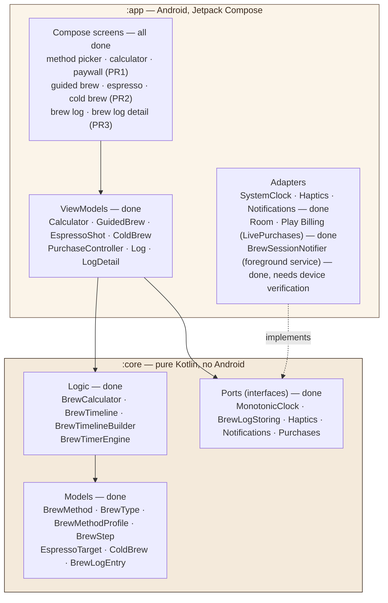
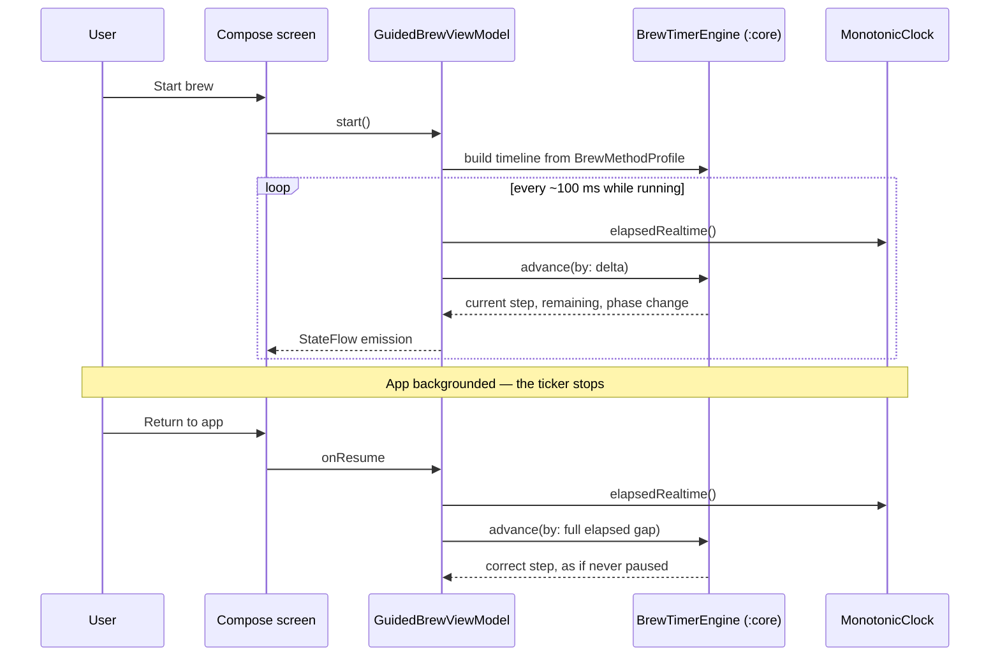

# CoffeeGrams for Android — Architecture

Two layers: a **pure Kotlin logic module** under a **thin Compose app**. Every
side effect crosses a port. This mirrors the iOS app deliberately — the shared
shape is what makes the two codebases maintainable in parallel.

> **Status (2026-08-14):** M2–M10 complete, M11 in progress — the
> Play Store screenshot harness (`ScreenshotCaptureTest.kt` +
> `Releases/screenshots/capture.sh`) is built and verified end-to-end;
> full unit + Compose UI suites are green. `:core` is fully ported: all 12 Models/Logic files and the
> `MonotonicClock` + `BrewLogStoring` ports, plus all 49 conformance tests
> (`./gradlew :core:test`, headless, warnings-as-errors). The Compose theme
> (`ui/theme/`) carries the real palette, type scale, and (new in M7) a
> spacing/shape token scale (`Spacing.kt`). `BrewMethod`'s placeholder icon
> mapping is ported (`design/`), and the adaptive icon + standalone logo
> mark are the real brand mark, transliterated from the iOS repo's
> `render.swift`. Persistence (`data/`) is a Room-backed `BrewLogStoring`
> adapter mirroring `BrewLogRecord`'s 11 columns exactly, with an
> in-memory test double. Platform adapters (`platform/`) add
> `MonotonicClock`, `Haptics`, and `Notifications` — the last backed by a
> notification channel plus `WorkManager` scheduling and a `ReminderWorker`
> that delivers the reminder. ViewModels (`viewmodel/`) add
> `CalculatorViewModel`, `GuidedBrewViewModel`, `EspressoShotViewModel`,
> `ColdBrewViewModel`, and `PurchaseController` — the first real callers of
> the M5 ports. `GuidedBrewViewModel`/`EspressoShotViewModel` own their own
> tick loop (see the sequence diagram below) rather than being driven
> externally as on iOS, so the timer survives a device rotation. **M7 PR1**
> puts the first real screens on-screen — Method Picker (with the Pro
> gate), Calculator, and Paywall — with a real navigation graph
> (`ui/navigation/`, type-safe routes). This required reversing M6's
> deferral of `PurchaseController`: it's now wired into
> `CoffeeGramsApplication`, backed by a new placeholder adapter,
> `platform/UnavailablePurchases.kt` (always not-purchased), until M8
> supplies the real `BillingClient` adapter — a straight swap of the
> adapter behind the port, not a change to `PurchaseController` or its
> callers. **M7 PR2** added the three brewing screens themselves — Guided
> Brew, Espresso Shot, Cold Brew — routed through `BrewSessionScreen`, each
> ending in a "Save to Log" action that writes a `BrewLogEntry` through
> `CoffeeGramsApplication.brewLogStore`. **M7 PR3** closes the loop with the
> brew log itself: `LogScreen` (the saved-brew list, reached from the method
> picker's toolbar) and `LogDetailScreen` (view/rate/annotate/delete one
> brew), backed by new `LogViewModel`/`LogDetailViewModel`s and a shared
> `StarRating` composable. `LogViewModel` reloads explicitly rather than
> observing a `Flow` — see its doc comment — since `BrewLogStoring` is a
> one-shot `suspend` port, matching the same reload-on-entry shape the nav
> graph already gives every route. **M7 shipped** (PR #10, merged
> 2026-08-10). **M8 shipped** (PR #11, merged 2026-08-12): replaced the
> `UnavailablePurchases` placeholder with `platform/LivePurchases.kt`, the
> real `BillingClient` adapter. **M9 shipped** (PR #12 + #14, merged
> 2026-08-14 — split across two PRs because the first was merged before the
> physical-device checklist ran; see `testing.md`'s M9 section for what
> that checklist found and fixed): adds `core/BrewSessionNotifier.kt`, a
> new port for the ongoing "brew in progress" notification, backed by
> `platform/LiveBrewSessionNotifier.kt` + a thin
> `platform/BrewTimerForegroundService.kt`. Its job is narrower than it
> might sound: `GuidedBrewViewModel`'s tick loop and
> `BrewTimerEngine.advance`'s elapsedRealtime-based catch-up already handle
> a brief backgrounding the process survives; what was missing, and what M9
> actually fixes, is Android killing the *process* outright while a brew is
> backgrounded — a live foreground service is what makes that rare. Scoped
> to guided brew only (V60, Chemex, French Press, AeroPress), not espresso
> shots, which run 20-40 seconds and don't carry the same backgrounding
> risk. **M10 shipped** (PR #15, merged 2026-08-14): the Play Store
> screenshot harness — `ScreenshotCaptureTest.kt` mirrors the iOS sibling's
> `ScreenshotCaptureTests.swift` exactly — the same five assertions run in
> every normal `connectedAndroidTest` pass, guarding against the listing
> going stale, while the shutter itself is opt-in behind a
> `captureScreenshots` instrumentation argument only
> `Releases/screenshots/capture.sh` sets. Unlike every other Compose UI
> test in this repo, it drives the real app end-to-end
> (`createAndroidComposeRule<MainActivity>()`, not an isolated screen +
> test double) — a screenshot of a test harness isn't a screenshot of what
> ships. **M11 (in progress)** is store listing & compliance prep, not app
> code: a Play Store icon (512×512) and feature graphic (1024×500) under
> `Releases/store-assets/`, draft listing copy (`Releases/store-listing.md`),
> a Play Console compliance answers runbook
> (`Releases/play-console-compliance.md`), and a `docs/` GitHub Pages site
> (privacy policy + support) — a separate copy from the iOS repo's own
> `docs/`, not reused as-is, since the iOS pages name SwiftData/App
> Store/Apple by name and would misdescribe this app. This document is
> updated as each milestone/PR lands.

---

## Layers



**The one rule that matters:** the arrow from `:app` to `:core` is one-way.
`:core` does not know `:app` exists, does not import `android.*` or `androidx.*`,
and runs headless under `./gradlew :core:test`. CI enforces this with a grep over
`core/src/` — an Android import fails the build.

`:core` applies the `kotlin-jvm` plugin rather than `kotlin-android` precisely so
that the Android SDK is not even on its compile classpath.

---

## Ports and adapters

Every side effect is an interface in `:core` with a live adapter in `:app` and a
test double. This is what lets the entire brewing engine be tested with no
emulator, and what made the iOS→Android port cheap in the first place.

| Port *(in `:core`)* | Live adapter *(in `:app`)* | Test double | Milestone |
|---|---|---|---|
| `MonotonicClock` — **ported (M2)**, adapter **built (M5)** | `LiveMonotonicClock` (`SystemClock.elapsedRealtime()`) | `FakeAdvancingClock` | M5 |
| `BrewLogStoring` — **ported (M4)** | `RoomBrewLogStore` (`BrewLogDao`) | `InMemoryBrewLogStore` | M4 |
| `Haptics` — **built (M5)** | `LiveHaptics` (`Vibrator`/`VibratorManager`) | `RecordingHaptics` | M5 |
| `Notifications` — **built (M5)** | `LiveNotificationScheduler` (channel + `WorkManager`) | `RecordingNotificationScheduler` | M5 |
| `Purchases` — **ported (M6)**, live adapter **built (M8)** | `LivePurchases` (`BillingClient`) | `ScriptedPurchases`, `UnavailablePurchases` | M6 (port), M7 PR1 (placeholder), M8 (real adapter) |
| `BrewSessionNotifier` — **built (M9)** | `LiveBrewSessionNotifier` + `BrewTimerForegroundService` | `RecordingBrewSessionNotifier` | M9 |

The `Purchases` port landed at M6 alongside its first caller,
`PurchaseController`, the same way `MonotonicClock`'s port landed at M2
while its live adapter waited for M5 — the interface and a caller don't need
a real implementation to exist and be tested. M7 PR1 went one step further
than that precedent: it wired a **placeholder production adapter**
(`UnavailablePurchases`) so the Pro-gated UI had something real to render
against before M8's actual billing integration existed. M8 replaces that
default in `CoffeeGramsApplication` with `LivePurchases`, but
`UnavailablePurchases` itself stays — it's now purely a test double, used
by `MethodPickerScreenTest`/`PaywallScreenTest` to keep those instrumented
tests deterministic and free of any live billing connection.

`LivePurchases` needs a foreground `Activity` to call `launchBillingFlow` —
unlike iOS's StoreKit call, and unlike the `Purchases.purchase()` port
signature itself, which carries none (ported 1:1 from iOS in M6). Rather
than threading an `Activity` type through `:core`, `LivePurchases` exposes
`attach(activity)`/`detach()` directly, wired from `MainActivity`'s
`onStart`/`onStop` — the app is single-`Activity`, so this is the same
shape Play's own `BillingClient` samples use. Acknowledgement (mandatory on
Play — an unacknowledged purchase auto-refunds within days, see
`testing.md`) happens defensively in three paths: after a fresh purchase,
and on every `isPurchased()`/`restore()` call, so a killed process or a
missed callback can never leave a purchase unacknowledged.

`BrewSessionNotifier` is the odd one out in this table: every other port
exists because `:core` needs a real capability (storage, haptics, a clock).
This one exists purely so `:app`'s process has a reason for Android not to
kill it — no `:core` timing logic depends on it, and `BrewTimerEngine`/
`MonotonicClock` are unchanged by M9. `LiveBrewSessionNotifier.start()`
launches `BrewTimerForegroundService` (which makes the actual
`startForeground()` call, typed `specialUse` — no built-in Android category
fits "an ongoing coffee brew"); `.update()` then talks to
`NotificationManagerCompat` directly rather than round-tripping back
through the service, since content updates don't need to.

`DiagnosticsService` from iOS is **deliberately dropped** — it only wrote to
`os.Logger` and has no Android counterpart worth building.

**No DI framework.** Dependencies are constructed by hand in
`CoffeeGramsApplication` and passed down constructors. Five ViewModels does not
justify Hilt, and every dependency avoided is one that cannot affect the
"Data Not Collected" declaration.

---

## Guided brew — the flow that carries the risk



`BrewTimerEngine` **never reads a clock itself.** It is a pure delta-driven state
machine whose only input is `advance(by:)`. That is what makes the resume path
above correct rather than approximate: fast-forwarding by a 3-minute gap is the
same operation as ticking, just larger.

**This diagram is now the implemented shape, as of M6** — `GuidedBrewViewModel`
and `EspressoShotViewModel` each own their tick loop via `viewModelScope.launch`,
cancelled automatically on `onCleared()`. This is a deliberate divergence from
the iOS sibling, where the *View* drives the equivalent 0.1s ticker and calls a
passive `tickOnce()`: on Android the View is exactly what gets destroyed on a
device rotation, so it can't be the cadence owner if the timer is meant to
survive one (M9). The tick function itself (`tick()`) stays exactly as passive
and pure as iOS's `tickOnce()` — only who calls it moved.

This is the single highest-risk area of the port (M9). Android freezes tickers
aggressively and Doze will stall a backgrounded app entirely, so the design is
**both** a foreground service with an ongoing notification **and** the
recompute-on-resume above — not one or the other.

---

## Testing topology

```mermaid
graph LR
    CT["`:core` unit tests<br/>JUnit 5 + kotlin.test<br/>the 49 ported cases"] -->|headless, no device| G1["./gradlew :core:test"]
    AT["`:app` unit tests<br/>ViewModels, Turbine on StateFlow"] -->|JVM| G2["./gradlew :app:testDebugUnitTest"]
    UI["Compose UI tests<br/>screens, TalkBack labels"] -->|emulator or device| G3["./gradlew :app:connectedAndroidTest"]
    MAN["Manual device pass<br/>billing · Doze · screen-off"] -->|physical device only| G4["M8 / M9 checklists"]

    style CT fill:#F4EADB,stroke:#3A2A1E,color:#3A2A1E
```

The 49 cases in `:core` are the **conformance spec**: they were written against
the shipping iOS app, so if they pass, identical inputs produce identical ratios,
timelines, and step transitions on both platforms. Any divergence is a port bug.

See [`testing.md`](testing.md) for how to run each suite.

---

## Module and package layout

| Path | Contents |
|---|---|
| `core/src/main/kotlin/com/jrlabapps/coffeegrams/core/` | Models, calculator, timeline builder, timer engine, ports |
| `core/src/test/kotlin/.../core/` | The ported conformance suite |
| `app/src/main/kotlin/com/jrlabapps/coffeegrams/` | `MainActivity`, `CoffeeGramsApplication` |
| `app/src/main/kotlin/.../ui/theme/` | Compose theme — palette, type scale, spacing/shape scale (`Spacing.kt`, M7) |
| `app/src/main/kotlin/.../design/` | App-layer presentation mappings (`BrewMethod`'s placeholder icon + subtitle), mirrors iOS's `Design/` folder |
| `app/src/main/res/drawable/ic_launcher_foreground.xml`, `logo_mark.xml` | The real brand mark (adaptive icon + standalone), transliterated from `coffeegrams_logo/render.swift` |
| `app/src/main/kotlin/.../ui/LocalApplication.kt` | `currentApplication()` — the one composable helper every screen uses to reach `CoffeeGramsApplication`'s dependency graph (no DI framework) |
| `app/src/main/kotlin/.../ui/navigation/` | `CoffeeGramsNavHost`, type-safe `@Serializable` routes *(M7 PR1)* |
| `app/src/main/kotlin/.../ui/methodpicker/`, `.../ui/calculator/`, `.../ui/paywall/` | Method Picker, Calculator, Paywall screens *(M7 PR1, done)* |
| `app/src/androidTest/kotlin/.../ui/` | Compose UI tests per screen package, mirroring `main`'s layout |
| `app/src/androidTest/kotlin/.../ScreenshotCaptureTest.kt` | The Play Store screenshot harness — top-level package since it drives the whole app, not one screen *(M10)* |
| `Releases/screenshots/capture.sh` | Drives `ScreenshotCaptureTest` with the shutter enabled, pulls and fits the frames — mirrors the iOS sibling's own `capture.sh` *(M10)* |
| `app/src/main/kotlin/.../ui/guidedbrew/`, `.../ui/espresso/`, `.../ui/coldbrew/` | Guided Brew, Espresso Shot, Cold Brew screens, routed through `BrewSessionScreen` *(M7 PR2, done)* |
| `app/src/main/kotlin/.../ui/log/` | `LogScreen` (list), `LogDetailScreen` (view/rate/annotate/delete), `StarRating` *(M7 PR3, done)* |
| `app/src/main/kotlin/.../data/` | `BrewLogEntity`, `BrewLogDao`, `BrewLogDatabase`, `RoomBrewLogStore` — the `BrewLogStoring` adapter |
| `app/src/test/kotlin/.../data/` | `InMemoryBrewLogStore` test double + its own contract test, entity↔entry mapping test |
| `app/src/androidTest/kotlin/.../data/` | `RoomBrewLogStoreTest` — the same contract, against real Room (needs a device/emulator) |
| `app/schemas/` | Room's exported schema JSON (`exportSchema = true`) — the v1 baseline future migrations diff against |
| `app/src/main/kotlin/.../platform/` | `LiveMonotonicClock`, `LiveHaptics`, `LiveNotificationScheduler`, `ReminderWorker`, `BrewReminder`, `UnavailablePurchases`, `LivePurchases` (`BillingClient` adapter, *M8*), `LiveBrewSessionNotifier`, `BrewTimerForegroundService` (*M9*) |
| `app/src/test/kotlin/.../platform/` | `FakeAdvancingClock`, `RecordingHaptics`, `RecordingNotificationScheduler` test doubles + their tests, plus JVM tests for `LiveNotificationScheduler.buildWorkRequest`, `ReminderWorker.contentFrom`, `BrewReminder`, `UnavailablePurchases`, `LivePurchasesTest` (the `classifyPurchaseResponse` mapping only — see its own doc comment for why the rest of `LivePurchases` isn't unit-testable), and `RecordingBrewSessionNotifier` (*M9*) |
| `app/src/main/kotlin/.../viewmodel/` | `CalculatorViewModel`, `BrewPreset`, `GuidedBrewViewModel`, `EspressoShotViewModel`, `ColdBrewViewModel`, `PurchaseController`, `LogViewModel`, `LogDetailViewModel` |
| `app/src/test/kotlin/.../viewmodel/` | Their ported conformance tests, plus `ScriptedPurchases` (the `Purchases` test double) and the `LogViewModel`/`LogDetailViewModel` tests (against `InMemoryBrewLogStore`) |
| `app/src/main/res/values/strings.xml` | UI strings, named `<screen>_<element>` (e.g. `method_picker_unlock_pro`, `calculator_start_espresso`) — the package each screen lives under in `ui/` |
| `gradle/libs.versions.toml` | Every dependency version, in one place |

---

## Build configuration

| Setting | Value | Why |
|---|---|---|
| `compileSdk` | **37.1** | Forced by AndroidX — core-ktx 1.19, activity-compose 1.13, lifecycle 2.11 and the Compose BOM all refuse a project compiling against 36 |
| `targetSdk` | **36** | The behaviour changes we opt into. Play's floor for new apps after 2026-08-31. Staying here means Android 17 runtime changes are not silently adopted |
| `minSdk` | **26** | Android 8.0. Covers effectively the whole active base; also means the adaptive icon is the only icon variant needed |
| AGP | **9.3.1** | Applies Kotlin itself — the `kotlin-android` plugin is gone and is rejected if applied |
| Kotlin | **2.4.10** | |
| Gradle | **9.7.0** | Configuration cache on |
| Warnings-as-errors | `:core` always; `:app` on release | The logic module is the correctness proof, so it is held to the stricter bar at all times |

**Third-party runtime dependencies: zero.** Everything shipped is Google or
JetBrains first-party. Turbine is the one exception and is test-only, never
packaged. This is what keeps the Play Data safety declaration at *no data
collected*, and it is a constraint to defend, not a coincidence.
