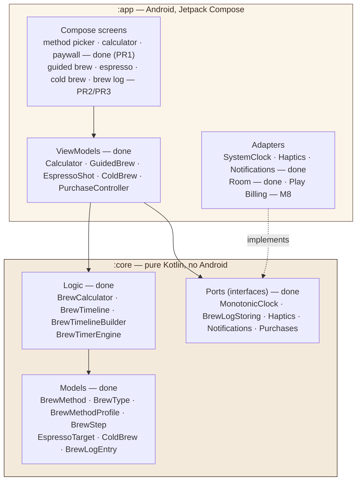
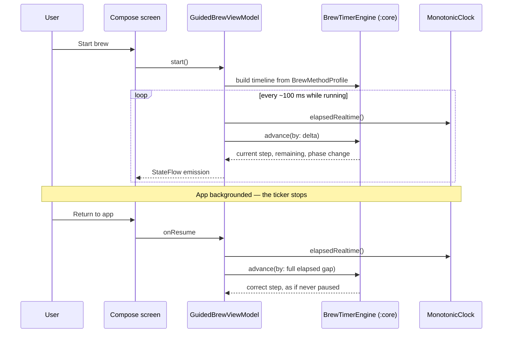

# CoffeeGrams for Android — Architecture

Two layers: a **pure Kotlin logic module** under a **thin Compose app**. Every
side effect crosses a port. This mirrors the iOS app deliberately — the shared
shape is what makes the two codebases maintainable in parallel.

> **Status (2026-08-09):** M2–M6 complete, M7 in progress (PR1 of 3
> landed). `:core` is fully ported: all 12 Models/Logic files and the
> `MonotonicClock` + `BrewLogStoring` ports, plus all 49 conformance tests
> (`./gradlew :core:test`, headless, warnings-as-errors). The Compose theme
> (`ui/theme/`) carries the real palette, type scale, and (new in M7) a
> spacing/shape token scale (`Spacing.kt`). `BrewMethod`'s placeholder icon
> mapping is ported (`design/`), and the adaptive icon + standalone logo
> mark are the real brand mark, transliterated from the iOS repo's
> `render.swift`. Persistence (`data/`) is a Room-backed `BrewLogStoring`
> adapter mirroring `BrewLogRecord`'s 11 columns exactly, with an
> in-memory test double. Platform adapters (`platform/`) add
> `MonotonicClock`, `Haptics`, and `Notifications` — the last backed by a
> notification channel plus `WorkManager` scheduling and a `ReminderWorker`
> that delivers the reminder. ViewModels (`viewmodel/`) add
> `CalculatorViewModel`, `GuidedBrewViewModel`, `EspressoShotViewModel`,
> `ColdBrewViewModel`, and `PurchaseController` — the first real callers of
> the M5 ports. `GuidedBrewViewModel`/`EspressoShotViewModel` own their own
> tick loop (see the sequence diagram below) rather than being driven
> externally as on iOS, so the timer survives a device rotation. **M7 PR1**
> puts the first real screens on-screen — Method Picker (with the Pro
> gate), Calculator, and Paywall — with a real navigation graph
> (`ui/navigation/`, type-safe routes). This required reversing M6's
> deferral of `PurchaseController`: it's now wired into
> `CoffeeGramsApplication`, backed by a new placeholder adapter,
> `platform/UnavailablePurchases.kt` (always not-purchased), until M8
> supplies the real `BillingClient` adapter — a straight swap of the
> adapter behind the port, not a change to `PurchaseController` or its
> callers. PR2 (Guided Brew/Espresso/Cold Brew screens) and PR3 (brew log)
> are still to come under the same M7 board card. This document is updated
> as each milestone/PR lands.

---

## Layers



**The one rule that matters:** the arrow from `:app` to `:core` is one-way.
`:core` does not know `:app` exists, does not import `android.*` or `androidx.*`,
and runs headless under `./gradlew :core:test`. CI enforces this with a grep over
`core/src/` — an Android import fails the build.

`:core` applies the `kotlin-jvm` plugin rather than `kotlin-android` precisely so
that the Android SDK is not even on its compile classpath.

---

## Ports and adapters

Every side effect is an interface in `:core` with a live adapter in `:app` and a
test double. This is what lets the entire brewing engine be tested with no
emulator, and what made the iOS→Android port cheap in the first place.

| Port *(in `:core`)* | Live adapter *(in `:app`)* | Test double | Milestone |
|---|---|---|---|
| `MonotonicClock` — **ported (M2)**, adapter **built (M5)** | `LiveMonotonicClock` (`SystemClock.elapsedRealtime()`) | `FakeAdvancingClock` | M5 |
| `BrewLogStoring` — **ported (M4)** | `RoomBrewLogStore` (`BrewLogDao`) | `InMemoryBrewLogStore` | M4 |
| `Haptics` — **built (M5)** | `LiveHaptics` (`Vibrator`/`VibratorManager`) | `RecordingHaptics` | M5 |
| `Notifications` — **built (M5)** | `LiveNotificationScheduler` (channel + `WorkManager`) | `RecordingNotificationScheduler` | M5 |
| `Purchases` — **ported (M6)**, placeholder adapter **(M7 PR1)** | `UnavailablePurchases` *(placeholder — always not-purchased; real `BillingClient` is M8, needs the physical-device milestone gate)* | `ScriptedPurchases` | M6 (port), M7 PR1 (placeholder), M8 (real adapter) |

The `Purchases` port landed at M6 alongside its first caller,
`PurchaseController`, the same way `MonotonicClock`'s port landed at M2
while its live adapter waited for M5 — the interface and a caller don't need
a real implementation to exist and be tested. M7 PR1 goes one step further
than that precedent: it wires a **placeholder production adapter**
(`UnavailablePurchases`) so the Pro-gated UI has something real to render
against before M8's actual billing integration exists — everything reads
as locked until then. This is different from a test double: it ships in
the app, not just in tests.

`DiagnosticsService` from iOS is **deliberately dropped** — it only wrote to
`os.Logger` and has no Android counterpart worth building.

**No DI framework.** Dependencies are constructed by hand in
`CoffeeGramsApplication` and passed down constructors. Five ViewModels does not
justify Hilt, and every dependency avoided is one that cannot affect the
"Data Not Collected" declaration.

---

## Guided brew — the flow that carries the risk



`BrewTimerEngine` **never reads a clock itself.** It is a pure delta-driven state
machine whose only input is `advance(by:)`. That is what makes the resume path
above correct rather than approximate: fast-forwarding by a 3-minute gap is the
same operation as ticking, just larger.

**This diagram is now the implemented shape, as of M6** — `GuidedBrewViewModel`
and `EspressoShotViewModel` each own their tick loop via `viewModelScope.launch`,
cancelled automatically on `onCleared()`. This is a deliberate divergence from
the iOS sibling, where the *View* drives the equivalent 0.1s ticker and calls a
passive `tickOnce()`: on Android the View is exactly what gets destroyed on a
device rotation, so it can't be the cadence owner if the timer is meant to
survive one (M9). The tick function itself (`tick()`) stays exactly as passive
and pure as iOS's `tickOnce()` — only who calls it moved.

This is the single highest-risk area of the port (M9). Android freezes tickers
aggressively and Doze will stall a backgrounded app entirely, so the design is
**both** a foreground service with an ongoing notification **and** the
recompute-on-resume above — not one or the other.

---

## Testing topology

```mermaid
graph LR
    CT["`:core` unit tests<br/>JUnit 5 + kotlin.test<br/>the 49 ported cases"] -->|headless, no device| G1["./gradlew :core:test"]
    AT["`:app` unit tests<br/>ViewModels, Turbine on StateFlow"] -->|JVM| G2["./gradlew :app:testDebugUnitTest"]
    UI["Compose UI tests<br/>screens, TalkBack labels"] -->|emulator or device| G3["./gradlew :app:connectedAndroidTest"]
    MAN["Manual device pass<br/>billing · Doze · screen-off"] -->|physical device only| G4["M8 / M9 checklists"]

    style CT fill:#F4EADB,stroke:#3A2A1E,color:#3A2A1E
```

The 49 cases in `:core` are the **conformance spec**: they were written against
the shipping iOS app, so if they pass, identical inputs produce identical ratios,
timelines, and step transitions on both platforms. Any divergence is a port bug.

See [`testing.md`](testing.md) for how to run each suite.

---

## Module and package layout

| Path | Contents |
|---|---|
| `core/src/main/kotlin/com/jrlabapps/coffeegrams/core/` | Models, calculator, timeline builder, timer engine, ports |
| `core/src/test/kotlin/.../core/` | The ported conformance suite |
| `app/src/main/kotlin/com/jrlabapps/coffeegrams/` | `MainActivity`, `CoffeeGramsApplication` |
| `app/src/main/kotlin/.../ui/theme/` | Compose theme — palette, type scale, spacing/shape scale (`Spacing.kt`, M7) |
| `app/src/main/kotlin/.../design/` | App-layer presentation mappings (`BrewMethod`'s placeholder icon + subtitle), mirrors iOS's `Design/` folder |
| `app/src/main/res/drawable/ic_launcher_foreground.xml`, `logo_mark.xml` | The real brand mark (adaptive icon + standalone), transliterated from `coffeegrams_logo/render.swift` |
| `app/src/main/kotlin/.../ui/LocalApplication.kt` | `currentApplication()` — the one composable helper every screen uses to reach `CoffeeGramsApplication`'s dependency graph (no DI framework) |
| `app/src/main/kotlin/.../ui/navigation/` | `CoffeeGramsNavHost`, type-safe `@Serializable` routes *(M7 PR1)* |
| `app/src/main/kotlin/.../ui/methodpicker/`, `.../ui/calculator/`, `.../ui/paywall/` | Method Picker, Calculator, Paywall screens *(M7 PR1, done)* |
| `app/src/androidTest/kotlin/.../ui/` | Compose UI tests per screen package, mirroring `main`'s layout |
| `app/src/main/kotlin/.../ui/guidedbrew/`, `.../ui/espresso/`, `.../ui/coldbrew/`, `.../ui/log/` | Remaining screens *(M7 PR2/PR3)* |
| `app/src/main/kotlin/.../data/` | `BrewLogEntity`, `BrewLogDao`, `BrewLogDatabase`, `RoomBrewLogStore` — the `BrewLogStoring` adapter |
| `app/src/test/kotlin/.../data/` | `InMemoryBrewLogStore` test double + its own contract test, entity↔entry mapping test |
| `app/src/androidTest/kotlin/.../data/` | `RoomBrewLogStoreTest` — the same contract, against real Room (needs a device/emulator) |
| `app/schemas/` | Room's exported schema JSON (`exportSchema = true`) — the v1 baseline future migrations diff against |
| `app/src/main/kotlin/.../platform/` | `LiveMonotonicClock`, `LiveHaptics`, `LiveNotificationScheduler`, `ReminderWorker`, `BrewReminder`, `UnavailablePurchases` |
| `app/src/test/kotlin/.../platform/` | `FakeAdvancingClock`, `RecordingHaptics`, `RecordingNotificationScheduler` test doubles + their tests, plus JVM tests for `LiveNotificationScheduler.buildWorkRequest`, `ReminderWorker.contentFrom`, `BrewReminder`, and `UnavailablePurchases` |
| `app/src/main/kotlin/.../viewmodel/` | `CalculatorViewModel`, `BrewPreset`, `GuidedBrewViewModel`, `EspressoShotViewModel`, `ColdBrewViewModel`, `PurchaseController` |
| `app/src/test/kotlin/.../viewmodel/` | Their 39 ported conformance tests, plus `ScriptedPurchases` (the `Purchases` test double) |
| `app/src/main/kotlin/.../billing/` | `BillingClient` adapter *(M8)* |
| `app/src/main/res/values/strings.xml` | UI strings, named `<screen>_<element>` (e.g. `method_picker_unlock_pro`, `calculator_start_espresso`) — the package each screen lives under in `ui/` |
| `gradle/libs.versions.toml` | Every dependency version, in one place |

---

## Build configuration

| Setting | Value | Why |
|---|---|---|
| `compileSdk` | **37.1** | Forced by AndroidX — core-ktx 1.19, activity-compose 1.13, lifecycle 2.11 and the Compose BOM all refuse a project compiling against 36 |
| `targetSdk` | **36** | The behaviour changes we opt into. Play's floor for new apps after 2026-08-31. Staying here means Android 17 runtime changes are not silently adopted |
| `minSdk` | **26** | Android 8.0. Covers effectively the whole active base; also means the adaptive icon is the only icon variant needed |
| AGP | **9.3.1** | Applies Kotlin itself — the `kotlin-android` plugin is gone and is rejected if applied |
| Kotlin | **2.4.10** | |
| Gradle | **9.7.0** | Configuration cache on |
| Warnings-as-errors | `:core` always; `:app` on release | The logic module is the correctness proof, so it is held to the stricter bar at all times |

**Third-party runtime dependencies: zero.** Everything shipped is Google or
JetBrains first-party. Turbine is the one exception and is test-only, never
packaged. This is what keeps the Play Data safety declaration at *no data
collected*, and it is a constraint to defend, not a coincidence.
